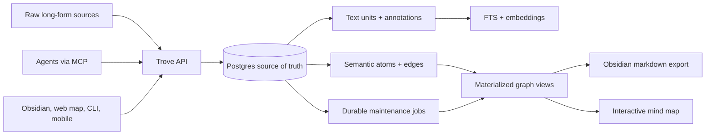
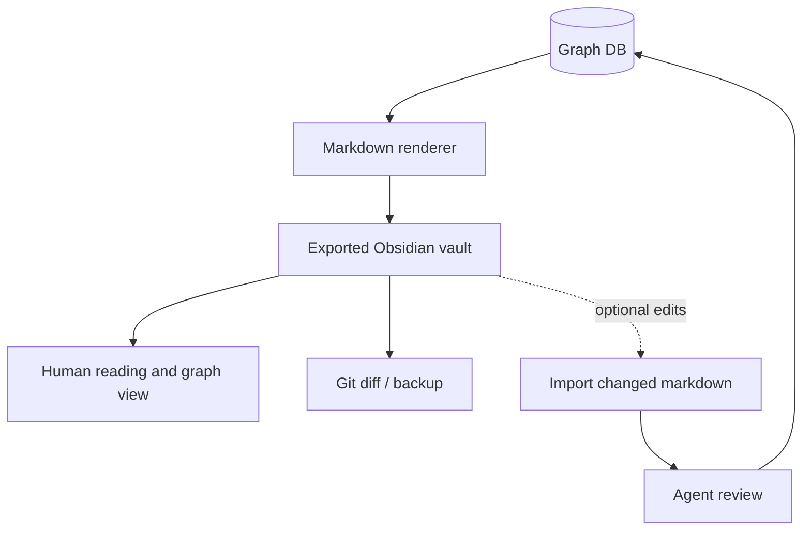
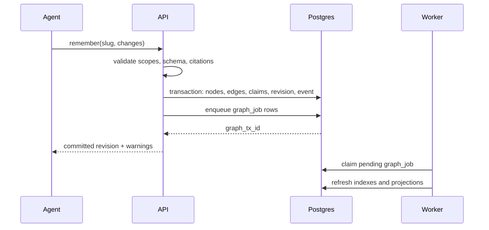

# Trove Architecture

## Thesis

The right next step is not "sync Obsidian better" or "put markdown behind an API." It is to turn Scribe into a small hosted information substrate where long-form evidence, semantic graph atoms, and interface projections are separate layers.

Today, the useful pattern is already clear:

- `index.md` is the catalog.
- `log.md` is the event journal.
- wiki pages are curated agent-written summaries.
- raw sources are immutable.
- query, ingest, capture, update, and lint are the core operations.

The fragile part is that markdown files are doing every job at once: storage, sync, locking, UI, graph model, audit trail, and agent API. That works locally, but it gets awkward when many devices and many agents need to coordinate.

Trove should make the evidence-backed graph the product:

## Requirements

### Functional

- Import the current Scribe vault as long-form source content without losing links, frontmatter, history, or raw sources.
- Split long text into addressable text units with stable source anchors.
- Let agents query, ingest, capture, update, lint, and export knowledge through one service.
- Preserve Obsidian compatibility through deterministic markdown export, but keep markdown as a projection.
- Model an evolving info graph, not just files: sources, text units, annotations, nodes, edges, claims, events, revisions, and saved views.
- Make mind maps first-class: generated views should be inspectable, saved, and refined over time.
- Support multiple interfaces without device-level sync: web, CLI, Obsidian plugin, mobile shortcut, and future app surfaces.
- Save mind maps as durable views that agents and interfaces can refine over time.
- Let interfaces consume a cursor event feed so they can update local projections without full-device sync.

### Non-Functional

- Lightweight enough to run as one app plus one database.
- Strong write correctness: transactions, revision checks, audit trail, soft deletes.
- Agent-safe: scoped tokens, source provenance, prompt-injection boundaries, and reversible changes.
- Searchable three ways: lexical, semantic, and graph-neighborhood.
- Maintainable as a hosted service: graph writes enqueue projection, lint, and embedding jobs instead of making agents run housekeeping manually.
- Portable: no lock-in to one model provider or one UI.

## Recommended Stack

### Source of Truth: Postgres

Use Postgres for the canonical graph.

Reasons:

- transactions and constraints matter more than exotic graph traversal in the first version
- nodes and edges are naturally relational tables
- recursive CTEs cover neighborhood traversal well enough for a personal/project knowledge graph
- `jsonb` handles flexible metadata while still preserving indexes and validation paths
- `pgvector` keeps embeddings beside the records they describe
- managed Postgres hosting gives backups, PITR, and operational maturity

Official references:

- Postgres `jsonb`: https://www.postgresql.org/docs/current/datatype-json.html
- Postgres JSON path/functions: https://www.postgresql.org/docs/current/functions-json.html
- pgvector: https://github.com/pgvector/pgvector

The storage decision is explicit in [storage-decision.md](/Users/anunay/dev/trove/docs/storage-decision.md): Postgres is the canonical write store, Kuzu is the preferred future traversal projection, and vector databases remain optional read indexes.

#### Schema migrations

`db/migrations/*.sql` is the source of truth for the schema; `db/schema.sql` is a historical bootstrap snapshot that fresh databases load first. `src/migrate.ts` applies the migrations on every container start and records each in `schema_migrations(filename, checksum, applied_at)`, so a file runs once and is skipped thereafter; a recorded file whose sha256 changed fails the boot and names the file, because applied migrations are immutable. The run holds a Postgres advisory lock so two instances booting side by side (a zero-downtime deploy) serialise instead of racing. Each file runs in its own transaction, unless its first line is exactly `-- trove:no-transaction`, which is for a single `create index concurrently ... if not exists` statement.

### Runtime: TypeScript Service

Use a small TypeScript service with:

- Hono or Fastify for HTTP
- MCP server endpoints for agents
- Drizzle or Kysely for typed SQL
- Zod for tool/input schemas
- background worker for import, export, embeddings, and lint

FastAPI would also fit your existing Cosmos mental model, but TypeScript has a smoother path for MCP, Obsidian plugin sharing, and web UI types. If Cosmos reuse becomes important, keep the protocol stable and swap runtime later.

### Search

Use layered retrieval:

1. Postgres full text search for exact terms, slugs, symbols, project names, and code paths.
2. `pgvector` for semantic recall.
3. Graph expansion to pull nearby canonical context.

Do not make a vector database the source of truth. Embeddings are an index over knowledge, not the knowledge.

### Agent Protocol

Expose MCP as the primary agent access path. MCP resources fit graph reads; MCP tools fit capture, ingest, update, lint, and export. HTTP JSON mirrors the same operations for non-agent interfaces.

### Hosting

Start with:

- Fly.io, Render, Railway, or a small VPS for the app
- Neon, Supabase, Railway Postgres, or self-hosted Postgres for the database
- S3/R2-compatible object storage for raw attachments and large source blobs
- a scheduled worker for export, lint, and embedding refresh

Cloudflare Durable Objects are interesting for per-user coordination or collaborative UI state. They now provide SQLite-backed, strongly consistent storage and are good at coordinating multiple clients, but their per-object shape is less natural for a deeply queryable canonical graph with embeddings and relational constraints. Treat Durable Objects as an optional edge/cache layer, not the first source of truth.

For traversal, keep v1 simple with recursive SQL over typed edge tables. Add Kuzu as a materialized graph index once mind-map exploration, path finding, or Cypher-style agent queries become central enough to justify a second read model.

Official references:

- Cloudflare Durable Objects overview: https://developers.cloudflare.com/durable-objects/
- SQLite-backed Durable Object storage: https://developers.cloudflare.com/durable-objects/api/sqlite-storage-api/

## Data Model

The substrate should separate durable primitives:

- `source`: immutable raw input or imported long-form document
- `text_unit`: addressable section, paragraph, chunk, quote, transcript segment, or OCR block
- `annotation`: meaning attached to a source span or text unit
- `node`: canonical semantic atom such as project, pattern, person, domain, claim, decision, task, question, or view
- `edge`: typed relationship between nodes
- `claim`: factual assertion with provenance, confidence, status, and validity window
- `revision`: materialized page/content version for a node
- `event`: append-only audit log of every graph mutation
- `view`: saved mind map/query projection
- `embedding`: vector index rows scoped to node, revision, source, or claim
- `job`: durable maintenance work for projection refresh, graph lint, and embedding refresh

This avoids the main markdown trap: a page can contain many facts, a long source can support many facts, and a fact can belong to multiple pages/views.

See [representation.md](/Users/anunay/dev/trove/docs/representation.md) for the deeper model.

## Markdown Projection

Markdown should remain a supported surface:

Rules:

- generated markdown has stable ordering
- frontmatter includes `trove_id`, `revision_id`, and `updated_at`
- wikilinks are rendered from edges
- `index.md` and `log.md` are generated from graph tables
- manual Obsidian edits are imported as proposals, not blindly applied

## Mind Map Model

A mind map is not the entire graph. It is a saved view over the graph.

Each saved view stores:

- root node or query
- included node ids
- included edge predicates
- layout positions
- grouping rules
- freshness policy
- narrative summary

Current implementation stores the root node/query, included node ids, included edge ids, layout JSON, and summary in `graph_view`. Agents can create/read/delete these views through MCP or HTTP, and the Obsidian projection exports each saved view as a `views/*.canvas` file.

This makes mind maps durable artifacts agents can edit. Example views:

- "What am I working on?"
- "Mission Control sync architecture"
- "Open production bugs"
- "Agent memory system"
- "People and recurring collaborators"

## Write Path

Agent writes should be proposal-shaped, even when applied automatically:

1. Agent calls `remember`, `connect`, or `ingest`.
2. Service validates schema, permissions, citations, and revision token.
3. Service writes all node/edge/claim/revision changes in one transaction.
4. Service appends events.
5. Service enqueues durable maintenance jobs.
6. Worker refreshes search vectors, markdown export, and affected mind-map views.
7. Interfaces poll `events` from their last cursor to update local UI/projections.

## Why Not Start With These

### Native Graph Database

Neo4j, Kuzu, or TypeDB may become useful later, but starting there adds operational weight before the graph has proven query patterns. Postgres edge tables plus recursive queries are enough for the MVP.

### CRDT Markdown Sync

CRDTs solve collaborative document editing. The harder problem here is semantic consistency across facts, claims, sources, and agent writes. Make the graph transactional first; add collaborative editing later if the UI demands it.

### Vector Database As Core

Vector search helps recall. It does not give provenance, constraints, conflict detection, audit trails, or deterministic exports.

### Obsidian Plugin First

An Obsidian plugin is valuable, but it should call the service. If plugin state becomes canonical, device sync problems return in a new costume.

## MVP Phases

### Phase 0: Import and Evidence Schema

- parse current vault
- store pages as sources
- split pages into text units with section paths and offsets
- extract wikilinks into edges and annotations
- generate stable slugs
- round-trip export with minimal diffs and a manifest-backed stale-file cleanup

### Phase 1: Agent Read Path

- `recall`
- `grep`
- `read`
- `neighborhood`
- MCP resource URIs

### Phase 2: Agent Write Path

- `remember`
- `connect`
- `forget`
- revision-token conflict checks
- event log
- actor, interface, and request attribution
- deterministic markdown export
- Obsidian vault projection with index, log, canvas mind map, node files, and manifest

### Phase 3: Lint and Evolution

- duplicate page detection
- orphan graph detection
- stale active-project detection
- contradiction candidates
- missing citation checks

### Phase 4: Interfaces

- simple web graph explorer
- Obsidian plugin that reads/writes through Trove
- CLI for import/export/admin
- mobile capture endpoint

## Success Test

The system is real when this works:

1. A new agent can connect through MCP and ask "what am I working on?"
2. Trove answers from the hosted graph, not from local synced files.
3. The agent writes a useful synthesis back with citations.
4. A second interface immediately sees the update.
5. Obsidian export produces a clean markdown diff.
6. The audit log says who changed what, from which source, and why.

That is the lightweight robust center: one information substrate, many interfaces, agents as maintainers, markdown as a projection, and every important semantic statement tied back to evidence.
