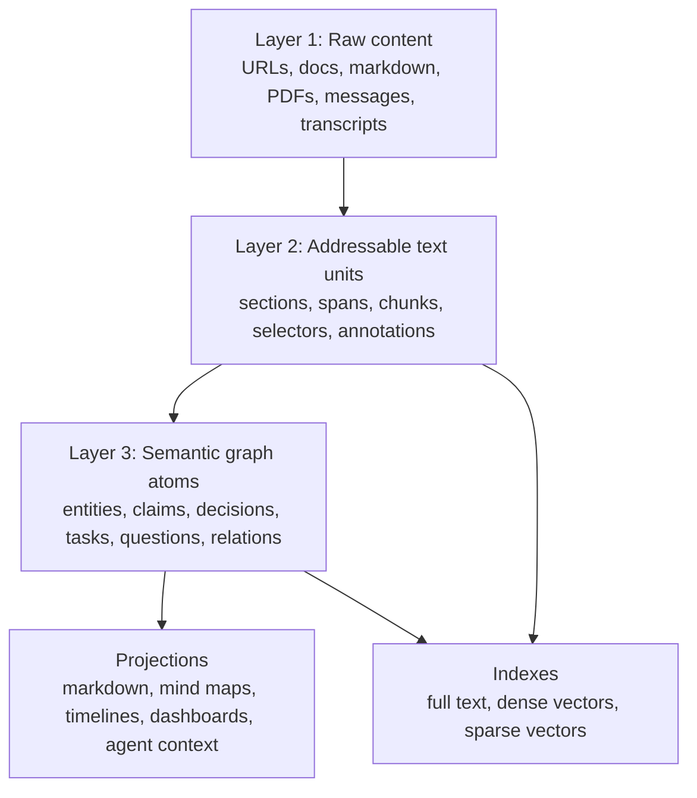

# Representation Model

## Reframe

Markdown is a useful artifact, but it is too coarse to be the core model.

Your end goal is closer to this:

> A hosted, agent-writable memory substrate where long-form information can be ingested, located, linked, summarized, contradicted, revised, visualized, and served to any interface.

That means the data model should start from evidence and meaning, not files.

## The Three-Layer Model



### Layer 1: Raw Content

Raw content is immutable or append-only. It stores what was actually seen:

- full markdown pages
- pasted notes
- PDFs and extracted text
- emails
- Slack threads
- browser captures
- screenshots plus OCR
- meeting transcripts
- generated agent answers

This layer cares about fidelity, checksums, source URLs, import time, and permissions. It does not care whether something is a "project" or "pattern" yet.

### Layer 2: Addressable Text Units

Long text needs stable addresses.

A text unit is a section, paragraph, chunk, quote, table row, transcript segment, or extracted OCR block. Each unit stores:

- source id
- ordinal
- parent unit id
- section path
- char offsets when available
- text
- checksum
- token count
- structural metadata

Annotations attach meaning to text units or exact spans. This is the key move. Instead of saying "this page says X", the system can say "this claim came from this exact source span."

The W3C Web Annotation model is useful inspiration here because it separates an annotation body from a target and supports selecting arbitrary content segments across resources. JSON-LD is useful as an interchange format because it lets normal JSON carry linked-data identifiers and graph meaning.

References:

- W3C Web Annotation Data Model: https://www.w3.org/TR/annotation-model/
- JSON-LD 1.1: https://www.w3.org/TR/json-ld11/

### Layer 3: Semantic Graph Atoms

The graph should not contain only pages. It should contain meaning-bearing atoms:

- Entity: person, project, repo, system, company, concept
- Claim: factual assertion, with status and provenance
- Decision: choice made, rationale, alternatives, date
- Task: open or completed work
- Question: unresolved inquiry
- Pattern: reusable rule or lesson
- Event: something that happened at a time
- Community: cluster of related nodes
- View: saved projection, such as a mind map

Edges carry typed relationships:

- `mentions`
- `supports`
- `contradicts`
- `supersedes`
- `caused_by`
- `part_of`
- `depends_on`
- `blocks`
- `decided_by`
- `derived_from`
- `similar_to`

The property graph model is a good mental model: nodes and relationships both carry properties. GraphRAG is a good retrieval pattern: extract entities, relationships, claims, and communities from raw text, then answer through that structure instead of plain text snippets.

References:

- Neo4j property graph concepts: https://neo4j.com/docs/getting-started/appendix/graphdb-concepts/
- Microsoft GraphRAG: https://microsoft.github.io/graphrag/
- GraphRAG dataflow: https://microsoft.github.io/graphrag/index/default_dataflow/

## The Better Unit Of Knowledge

The atomic unit should not be:

- a markdown page
- a vector chunk
- a graph node alone
- an LLM summary

The atomic unit should be an evidence-backed semantic atom:

```json
{
  "kind": "claim",
  "statement": "Trove should treat markdown as a projection, not the source of truth.",
  "status": "active",
  "derived_from": [
    {
      "source_id": "src_123",
      "text_unit_id": "unit_456",
      "selector": {
        "type": "TextPositionSelector",
        "start": 1204,
        "end": 1438
      }
    }
  ],
  "edges": [
    {
      "predicate": "supports",
      "to": "decision_trove_information_substrate"
    }
  ]
}
```

This is what lets the system handle long text without drowning in it. Long content stays as evidence. The graph contains compressed meaning. Retrieval can move between them.

## Retrieval Model

Use four retrieval modes together:

1. Exact lookup: slug, id, source URL, project name, date.
2. Full text search: precise matching over long text and node titles.
3. Semantic search: embeddings over text units and graph atoms.
4. Graph expansion: neighbors, communities, timelines, contradictions, dependencies.

Postgres full text search is the live lexical retrieval path for Trove nodes, revisions, and text units. `pgvector` handles semantic retrieval in the same database when embedding refresh is configured with a real provider; otherwise hybrid search falls back to lexical rather than storing fake vectors. If scale demands it later, Qdrant or another vector store can become a specialized index, but not the canonical memory.

References:

- Postgres full text search: https://www.postgresql.org/docs/current/textsearch.html
- pgvector: https://github.com/pgvector/pgvector

## Storage Choice

Postgres remains a strong first canonical store, but the reason is not "markdown pages fit in SQL."

The reason is:

- source documents need transactions and provenance
- text units need stable foreign keys
- graph atoms need constraints
- agent writes need optimistic locking
- annotations need exact target references
- projections need reproducible generation
- audit events need append-only consistency

Kuzu is worth watching or using as an embedded analytical graph projection when graph traversals become large and complex. It supports a property graph model, Cypher, embedded use, and analytical graph workloads. I would not put it first as the hosted source of truth until the write path is proven.

Reference:

- Kuzu docs: https://kuzudb.github.io/docs/

## Projection Model

Interfaces should be generated from the substrate:

| Projection | Source |
|---|---|
| Markdown page | node + claims + selected source spans + outbound edges |
| Obsidian vault | rendered node set + index + log |
| Mind map | saved view over nodes, edges, communities, and layout |
| Agent context | query result + evidence spans + neighborhood |
| Timeline | events + decisions + revisions |
| Dashboard | filtered graph views |

No projection should be the only place where meaning lives.

Trove now treats a mind map as a `graph_view`: a durable saved projection with a root node or search query, included node ids, included edge ids, layout JSON, and a summary. Obsidian Canvas files are generated from those views, so the visual map is portable while the view definition stays canonical in Postgres.

## Agent Write Model

An agent write should generally create or update:

- one source or source span
- one or more semantic atoms
- edges between atoms
- annotations tying atoms back to evidence
- an audit event
- invalidation jobs for projections and indexes

This lets agents work like maintainers. They can ingest a 20,000-word transcript, but the durable graph might only receive:

- 12 entities
- 8 claims
- 3 decisions
- 5 tasks
- 20 edges
- links back to 40 exact text spans

That is a much better compression boundary than a giant markdown note.

## First-Principles Decision

Build Trove as an evidence graph, not a note app.

The canonical entities are:

- sources
- text units
- annotations
- semantic atoms
- edges
- events
- projections

Markdown is just one renderer. Mind maps are just one view. Vector search is just one index. The enduring value is the agent-maintained semantic layer with proof trails back to long-form evidence.
