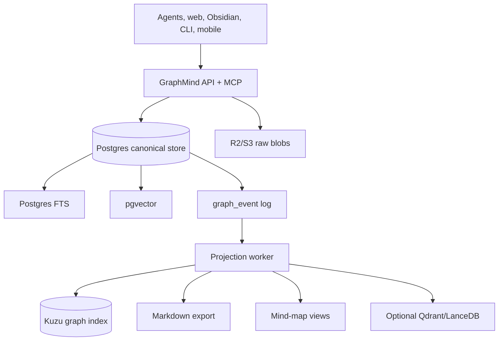

# Storage And Traversal Decision

## Decision

Use this stack:

1. Canonical store: Postgres.
2. Raw content store: S3/R2-compatible object storage for large originals, with extracted text and metadata in Postgres.
3. Search v1: Postgres full text search live by default, plus `pgvector` when real embeddings are configured.
4. Traversal v1: typed edge tables plus recursive SQL queries.
5. Maintenance: Postgres-backed `graph_job` queue for projection, lint, and embedding refresh.
6. Traversal v2: Kuzu as a materialized property-graph index fed from the Postgres event log.
7. Interchange: JSON-LD and Web Annotation style selectors for portable annotations, not as the first canonical database.

This gives GraphMind one robust source of truth while keeping a clean escape hatch for graph-native traversal.

## Why This Is The Right Shape

GraphMind has two different workloads:

- writes that must be safe: ingest, capture, update, annotate, revise, audit
- reads that must be exploratory: semantic search, graph traversal, mind-map expansion, community summaries

Those should not be forced into one storage trick.

The canonical store must optimize for correctness:

- agent writes need transactions
- revisions need optimistic locks
- annotations need source-span integrity
- claims need provenance
- projections need deterministic rebuilds
- every write needs an audit trail
- workers need durable jobs that can be retried, deduped, and inspected by agents

The traversal layer can optimize for exploration:

- neighborhood expansion
- path finding
- community detection
- graph analytics
- Cypher-like querying
- mind-map layout preparation

## Candidate Matrix

| Candidate | Best At | Weakness | Decision |
|---|---|---|---|
| Postgres + edge tables | safe writes, long text metadata, events, constraints, SQL, hosting | graph traversal gets awkward at depth/scale | Canonical v1 |
| Postgres job table | simple durable work queue near graph mutations | not a distributed workflow engine | Maintenance v1 |
| Postgres + pgvector | keeps vectors with relational data and joins | not a full retrieval/rerank platform | Search v1 |
| Apache AGE | Cypher inside Postgres, one database | extension availability and maturity vary across hosts | Optional, not baseline |
| Kuzu | embedded property graph, Cypher, analytical graph traversal | not the safest primary multi-interface write store | Traversal projection v2 |
| Neo4j | mature graph database and tooling | extra server, extra sync path, less natural for long raw docs/events | Defer |
| ArangoDB | all-in-one document, graph, search, vector | less familiar ops, cluster transaction caveats, product surface bigger than needed | Strong alternative, not v1 |
| Memgraph | fast real-time graph analytics | graph-first and RAM-oriented posture is not ideal for long evidence archive | Defer |
| RDF triple store / Jena Fuseki | standards, SPARQL, linked data interchange | higher modeling/query complexity for personal agent memory | Interchange/export only |
| Qdrant / LanceDB | serious hybrid/vector retrieval | not canonical truth for claims, events, provenance, permissions | Optional search index later |
| SQLite / Durable Objects | very light coordination and edge state | query/traversal/vector ecosystem too constrained for canonical graph | Edge cache or tiny single-user variant |

## Source Findings

### Postgres

Postgres gives the safest base:

- recursive CTEs can traverse graph-shaped edge tables for the first version
- JSONB stores flexible metadata without losing validity and indexing
- full text search is built in
- managed hosting, backups, point-in-time recovery, and operational tooling are mature

Sources:

- Recursive CTEs: https://www.postgresql.org/docs/current/queries-with.html
- JSONB: https://www.postgresql.org/docs/current/datatype-json.html
- Full text search: https://www.postgresql.org/docs/current/textsearch.html

### pgvector

`pgvector` supports exact and approximate nearest-neighbor search while keeping vectors in Postgres, next to the data they describe. That is enough for v1 semantic search and avoids a second persistence system before retrieval quality proves it needs one.

Source:

- https://github.com/pgvector/pgvector

### Apache AGE

Apache AGE adds graph functionality and openCypher to Postgres. It is attractive because it preserves one canonical store, but it should be optional until the deployment target definitely supports it.

Source:

- https://age.apache.org/age-manual/master/intro/overview.html

### Kuzu

Kuzu is the most interesting traversal companion. It is embedded, property-graph oriented, supports Cypher, and is designed for analytical workloads over large graphs. That makes it a good materialized index for GraphMind views and graph exploration.

Use it after the event log exists:

```text
Postgres graph_event -> projection worker -> Kuzu graph index -> graph traversal / mind map / analytics
```

Do not make Kuzu the first source of truth because GraphMind's hardest problem is not graph analytics. It is safe, provenance-rich, multi-agent writes.

Source:

- https://kuzudb.github.io/docs/

### ArangoDB

ArangoDB is the strongest "single database does everything" alternative. It combines document, graph, search, and vector capabilities, and AQL can compose graph traversals with search. If you wanted the least number of storage products at all costs, ArangoDB deserves a serious prototype.

Why not pick it first:

- Postgres is safer and more conventional for evented write correctness
- the product surface is larger than the MVP needs
- cluster transaction semantics have caveats compared with simple single-writer Postgres semantics

Sources:

- Feature list: https://docs.arango.ai/arangodb/stable/features/list/
- Graph data model: https://docs.arango.ai/arangodb/stable/concepts/data-models/

### Neo4j And Memgraph

Neo4j and Memgraph are graph-first. They become attractive when the graph itself dominates the workload. GraphMind starts from long evidence, agent writes, revision history, source spans, and projections. A graph-first primary database would make those non-graph concerns feel bolted on too early.

Sources:

- Neo4j property graph concepts: https://neo4j.com/docs/getting-started/appendix/graphdb-concepts/
- Memgraph database: https://memgraph.com/memgraphdb

### RDF / Jena Fuseki

RDF and SPARQL are compelling if external semantic interoperability is the main product. For GraphMind, they are better as export/import formats. JSON-LD can preserve linked semantics in normal JSON, and Web Annotation selectors can describe exact source targets without forcing the whole system into SPARQL.

Sources:

- Apache Jena Fuseki: https://jena.apache.org/documentation/fuseki2/
- JSON-LD: https://www.w3.org/TR/json-ld11/
- Web Annotation Data Model: https://www.w3.org/TR/annotation-model/

### Qdrant And LanceDB

Qdrant and LanceDB are good retrieval engines. They support hybrid search patterns that combine dense vectors with lexical/sparse retrieval and reranking. They should be treated as read indexes, not the canonical knowledge graph.

Sources:

- Qdrant hybrid queries: https://qdrant.tech/documentation/search/hybrid-queries/
- LanceDB hybrid search: https://docs.lancedb.com/search/hybrid-search

## Recommended Physical Architecture



## Implementation Guidance

Start with only:

- Postgres
- object storage
- app service
- worker

Add Kuzu when one of these becomes true:

- recursive SQL queries become hard to maintain
- mind-map expansion needs repeated multi-hop traversal
- you need shortest paths, community exploration, or graph analytics
- agents need Cypher-style graph queries

Add Qdrant/LanceDB only after an eval set shows Postgres FTS plus pgvector is not good enough.

Add ArangoDB only if a prototype proves that its all-in-one query model materially reduces complexity more than Postgres reduces operational risk.

## The Plain-English Architecture

Postgres is the ledger and evidence vault.

Kuzu is the fast graph lens.

Object storage is the attic for originals.

pgvector and full text search are the first memory index.

Markdown, mind maps, and dashboards are projections.

Agents talk to the service, never to storage directly.
